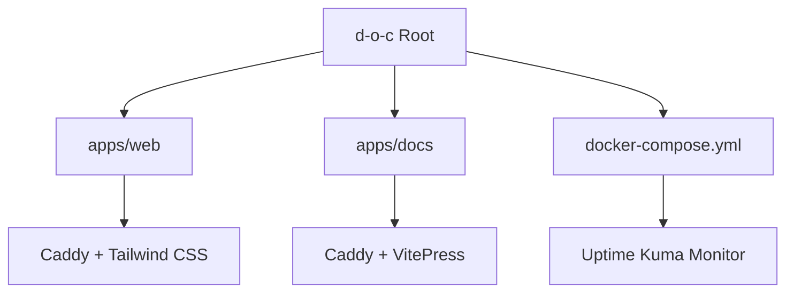

# d-o-c

Welcome to the **Documentation Operations Center** - A containerized documentation and monitoring infrastructure using pnpm workspaces, VitePress, and Docker Compose.

## What is d-o-c?

d-o-c is a comprehensive documentation and monitoring operations center that provides:

- **Web Frontend**: Modern web interface with Tailwind CSS served by Caddy
- **Documentation**: This VitePress-powered documentation site served by Caddy
- **Status Monitor**: Uptime Kuma dashboard for service monitoring and alerts

## Quick Start

Get started with d-o-c in just a few steps:

```bash
# Clone the repository
git clone https://github.com/svx/d-o-c.git
cd d-o-c

# Install dependencies
task install

# Start development servers
task dev
```

## Features

::: info Modern Tooling
Built with modern tools including pnpm workspaces, Docker Compose, and Task runner.
:::

::: warning Prerequisites
Make sure you have Node.js (v18+), pnpm (v8+), and Docker installed.
:::

::: tip Next Steps
Check out the [Getting Started Guide](/guide/getting-started) to learn more about setting up and using d-o-c.
:::

## Architecture Overview



## Quick Links

- [Getting Started](/guide/getting-started)
- [Quick Start](/guide/quick-start)
- [Web Frontend](/web/)
- [Installation Guide](/guide/installation)